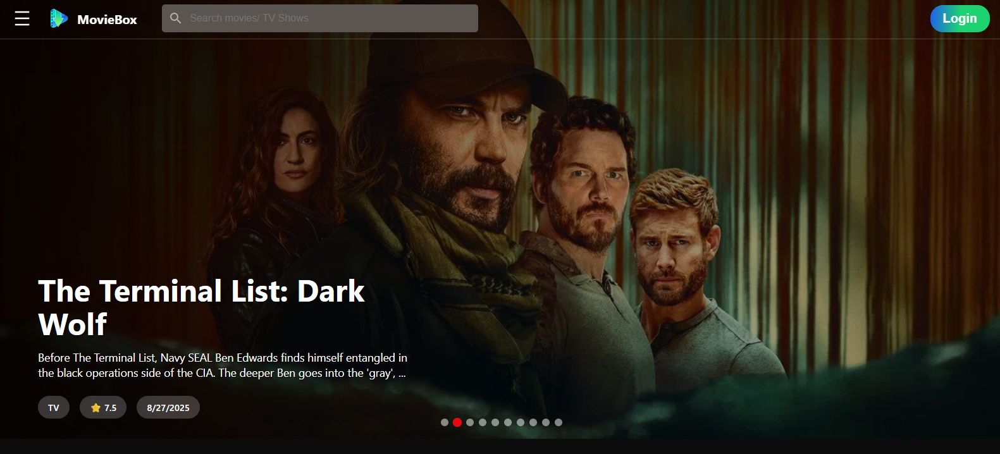
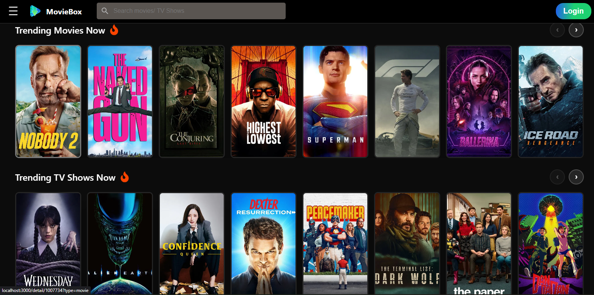
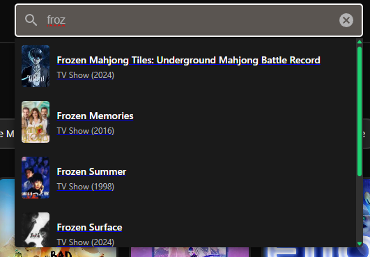
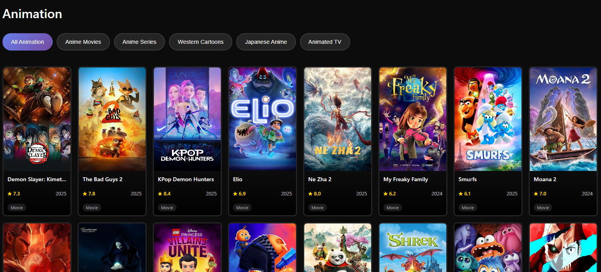

# 🎬 Cineverse  

  

## 📌 Project Overview  

**Cineverse** is a React web application that allows users to **explore, search, and view details** about movies and TV shows.  
It features **trending content, genre-based browsing, region-based categories, and user authentication**, providing a modern and engaging streaming discovery experience.  

---

## 🎯 Purpose  

✨ Discover movies and TV shows by genre and region  
✨ Explore trending content and featured series  
✨ Responsive and animated interface for a smooth experience  
✨ User authentication for personalized features  

---

## 🚀 Key Features  

- 🏠 **Home page** with trending and featured content  
- 🎭 **Genre & region-based browsing** (Anime, Marvel, K-Drama, C-Drama, Turkish Drama, French/Arabic Dubbed, HBO, Netflix, etc.)  
- 🔍 **Search** for movies and TV shows  
- 📖 **Detailed movie/show view** with descriptions and posters  
- 🔐 **User authentication** (Firebase)  
- 💻 **Modern, animated, responsive UI**  

---

## 🛠️ Tech Stack  

| Technology | Usage |
|------------|-------|
| ⚛️ **React** | Frontend UI |
| 🔄 **Redux** | State management (`moviesSlice.js`, `userSlice.js`) |
| 🔥 **Firebase** | Authentication & backend |
| 🎨 **CSS** | Styling & animations |
| 🧪 **Jest / React Testing Library** | Unit testing |
| 🗂️ **Helpers** | Utility functions (`utils/helpers.js`) |

---

## 📸 Screenshots / Demo  

  

  

  

  

---

## 📈 Portfolio Value  

This project highlights your ability to:  

✅ Build scalable, maintainable React apps  
✅ Integrate Redux for complex state management  
✅ Implement Firebase authentication  
✅ Design modern, animated, responsive UI  
✅ Organize code with reusable components  
✅ Write unit tests for reliability  

